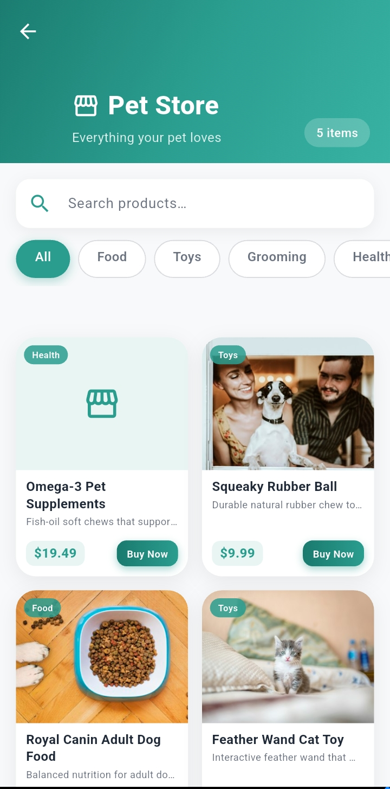
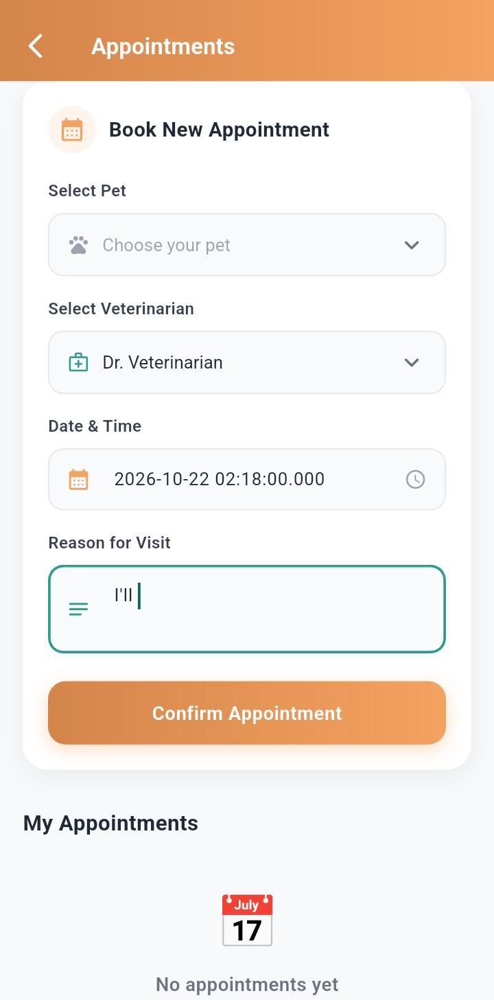
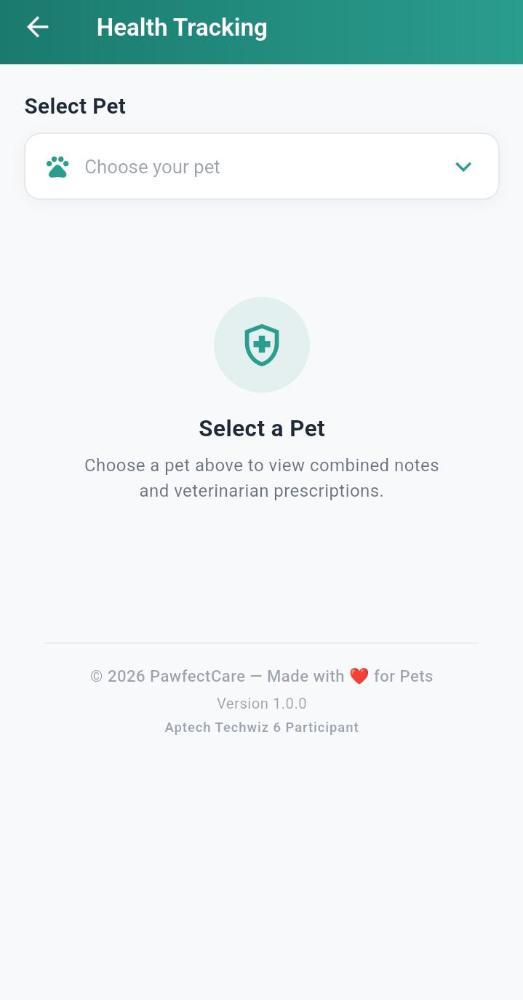
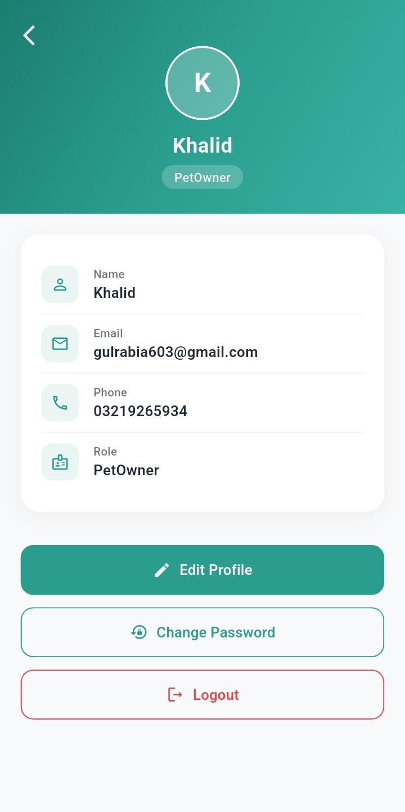

# Pawfectcare

A pet care management app where pet owners can manage their pets, book appointments, track their pets' health and keep medical records in one place.

**Tech stack:** Flutter, Firebase, GetX

## Features
- Pet profile management
- Owner profile management
- Appointment scheduling
- Health tracking
- Medical record keeping
- Firebase authentication and database

## Screenshots

  
  
  
  

---
Built by [Tahir Khan](https://github.com/tahirkhan8709)
